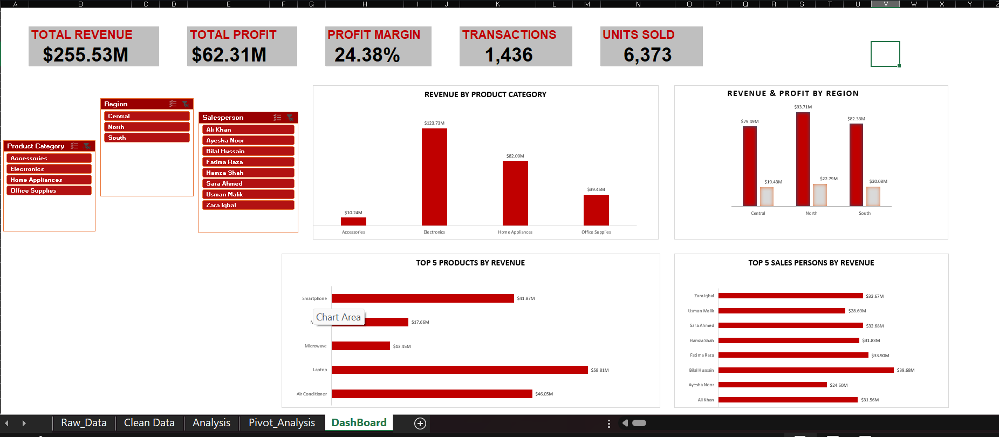

# 📊 Retail Sales Performance Dashboard | Excel

## 📊 Dashboard Preview

## 📌 Project Overview
This project analyzes retail sales data using Microsoft Excel and presents the results through an interactive sales performance dashboard.

The project covers the complete analysis workflow from raw data cleaning to KPI calculation, PivotTable analysis, visualization, and interactive dashboard development.

## 🎯 Project Objectives
- Clean and prepare raw retail sales data
- Analyze revenue and profitability
- Compare performance across product categories and regions
- Identify top-performing products and salespersons
- Build an interactive Excel dashboard for business reporting

## 🧹 Data Cleaning
The dataset was cleaned and prepared before analysis, including:

- Removing duplicate records
- Handling formatting inconsistencies
- Cleaning text fields
- Standardizing capitalization
- Formatting dates, currency, and percentages
- Checking blanks and errors
- Preparing the dataset for analysis

The final cleaned dataset contains *1,436 transactions*.

## 📈 Key KPIs

| KPI | Result |
|---|---:|
| Total Revenue | $255.53M |
| Total Profit | $62.31M |
| Profit Margin | 24.38% |
| Transactions | 1,436 |
| Units Sold | 6,373 |

## 📊 Dashboard Analysis

The dashboard includes:

- Revenue by Product Category
- Revenue & Profit by Region
- Top 5 Products by Revenue
- Top 5 Salespersons by Revenue
- Interactive Product Category filter
- Interactive Region filter
- Interactive Salesperson filter

## 🛠️ Excel Skills Used
- Data Cleaning
- Excel Tables
- Formulas
- PivotTables
- PivotCharts
- KPI Calculations
- Slicers
- Value Filters / Top-N Analysis
- Custom Number Formatting
- Dashboard Design
- Interactive Reporting

## 💡 Project Workflow

Raw Data → Data Cleaning → Analysis → PivotTables → Interactive Dashboard

## 📁 Workbook Structure

- Raw_Data – Original dataset
- Clean Data – Cleaned and standardized dataset
- Analysis – KPI calculations
- Pivot_Analysis – PivotTables supporting the analysis
- Dashboard – Final interactive dashboard

## 🚀 About This Project

This project was created as part of my Data Analyst portfolio to strengthen practical Excel skills in data cleaning, business analysis, visualization, and dashboard development.
